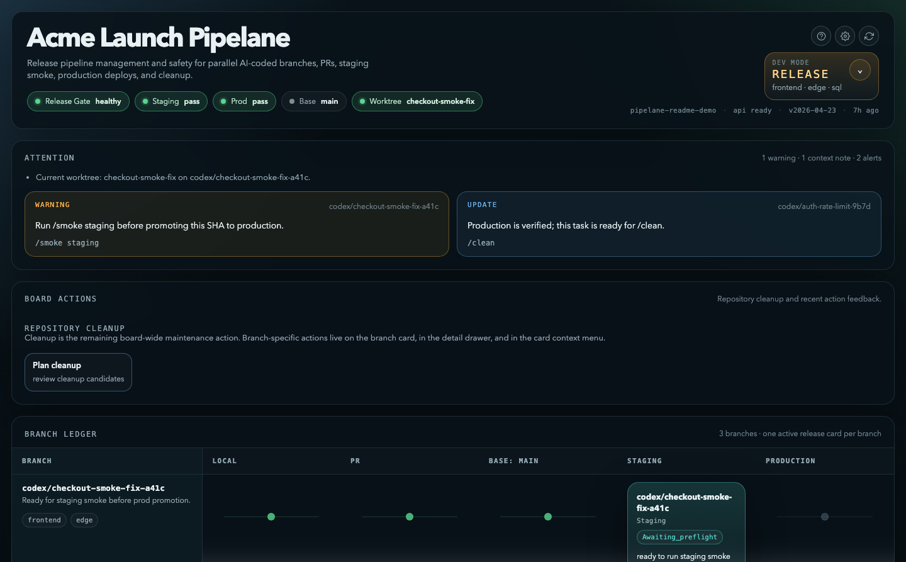

# Pipelane

> Release pipeline management and safety for AI vibe coders.

AI coding makes it easy to create five branches, three worktrees, two half-open PRs,
and one deployment that nobody is fully sure about.

Pipelane gives a repo a visible release pipeline and a small set of safe actions for
moving work through it. It is built for solo builders and small teams using Claude,
Codex, or both to ship real product code quickly.

Use it when you want:

- every active branch and worktree to be easy to find again
- a clear difference between fast build flow and protected release flow
- staging and production deploys tied to the same merged SHA when safety matters
- smoke checks, release gates, rollback, and cleanup built into the workflow
- a durable `/fix` loop for bugs, review findings, and code-quality repairs



## What Pipelane Is

Pipelane is a local, repo-native release workflow layer.

It installs a small workflow contract into your repo, adds slash commands for Claude
and Codex, and ships a local web board for seeing branch, PR, smoke, deploy, and
cleanup state in one place.

Pipelane is not:

- an AI model
- a hosted SaaS dashboard
- a project management board
- a replacement for git, GitHub, CI, or your deploy platform

Pipelane is closer to a release cockpit:

- **Pipeline management:** see what is in flight, recover worktrees, open PRs,
  merge, deploy, and clean up finished work.
- **Release safety:** choose build mode for speed or release mode for staging-first
  promotion of the same merged SHA.
- **Repair discipline:** use `/fix` to turn bugs, CI failures, review comments,
  and code-quality findings into root-cause fixes.

## Start With `/pipelane`

In a Pipelane-enabled repo, run:

```text
/pipelane
```

That prints the workflow guide. The important part is choosing the right lane.

### Build Journey

Build mode is the fast path. Use it when you want the shortest route from branch
to production and do not need required staging validation for the same SHA.

```text
/status                 See what is already in flight.
/devmode build          Use the fast lane.
/new "task name"        Create a clean task worktree and branch.
/pr                     Run pre-PR checks, commit, push, and open or update the PR.
/merge                  Merge the PR and record the merged SHA.
/smoke prod             Optional: run production-safe smoke checks if configured.
/clean                  Clean up finished task state after production is verified.
```

Build mode is for normal product iteration, small fixes, and repos where production
deploys already happen safely after merge.

### Release Journey

Release mode is the protected path. Use it when staging must prove the exact same
merged SHA before production can move.

```text
/status                 See active tasks, deploy state, and release gates.
/devmode release        Use the protected lane.
/new "task name"        Create a clean task worktree and branch.
/pr                     Run pre-PR checks, commit, push, and open or update the PR.
/merge                  Merge the PR and record the merged SHA.
/deploy staging         Deploy the merged SHA to staging.
/smoke staging          Run or verify staging smoke checks.
/deploy prod            Promote that same SHA to production.
/smoke prod             Optional: run production-safe smoke checks.
/clean                  Clean up finished task state after production is verified.
```

Release mode is for risky changes, multi-surface deploys, customer-facing launches,
database or edge changes, or any moment where "I think prod has the right thing"
is not good enough.

### Helpful Anytime

```text
/pipelane web           Open the local Pipelane Board.
/status                 Render a terminal cockpit from the same API as the board.
/resume                 Reopen or recover an existing task workspace.
/doctor                 Diagnose deploy config, probes, and release readiness.
/rollback prod          Roll production back to the last verified-good deploy.
/fix                    Fix bugs, review findings, CI failures, and code-quality issues.
/fix rethink            Plan a bigger codebase restructure before changing code.
```

## The Pipelane Board

`/pipelane web` opens a local web board for the current repo.

The board is useful when AI-generated work is happening in parallel and the state
is hard to hold in your head. It shows:

- attention items first
- current dev mode and release gate status
- staging and production smoke state
- one active pipeline card per branch
- branch files, workspace files, and patch previews on demand
- preflighted actions for deploy, cleanup, and other workflow steps

The board is local-first. It reads the repo's public `pipelane:api` contract and
does not become the source of truth. Git, GitHub, CI, and Pipelane state remain the
source of truth.

## Why Build Mode And Release Mode Both Exist

Fast development and safe release are different jobs.

Build mode keeps the loop short:

- make a branch
- open a PR
- merge
- let the normal production path take over
- clean up

Release mode adds a gate:

- merge once
- deploy that merged SHA to staging
- run smoke checks
- promote that same SHA to production
- verify production

The point is not ceremony. The point is knowing exactly which code is in which
environment, especially when AI operators are producing many branches at once.

## Where `/fix` Fits

Pipelane also installs `/fix`, because release safety is not only deploy order.
It is also bug quality and code quality.

`/fix` is for findings from:

- human review
- PR comments
- CI failures
- `/smoke`
- `/qa` or other test runs
- pasted errors
- code-quality reviews

The command is deliberately strict. It asks for the root cause, checks
`REPO_GUIDANCE.md` for repo-specific invariants, scans for sibling bugs, and refuses
cheap shims like swallowing errors or adding one-off special cases without explaining
the caller that produced the bad state.

Use `/fix` when you want the codebase to get healthier, not just quieter.

## What Gets Installed

Bootstrapping Pipelane into a repo adds or manages:

- `.pipelane.json`, or `.project-workflow.json` if you want a tool-neutral name
- `.claude/commands/*` for repo-tracked Claude slash commands
- `.agents/skills/*` for repo-tracked Codex skills
- `pipelane/CLAUDE.template.md` for machine-local operator config
- `docs/RELEASE_WORKFLOW.md` for the repo's operator guide
- Pipelane sections in `README.md`, `CONTRIBUTING.md`, and `AGENTS.md`
- canonical `npm run pipelane:*` scripts in `package.json`
- local `CLAUDE.md` for each release operator's private deploy config
- `REPO_GUIDANCE.md`, used by `/fix` to preserve repo-specific rules

## Install

Start from a repo that already has git, a base branch, and at least one commit.
The default safe `/new` flow branches from `origin/<base>`, so a pushed `origin`
remote is recommended.

```bash
npx -y pipelane@github:jokim1/pipelane#main bootstrap --project "My App"
```

If `pipelane` is already on your `PATH`, use:

```bash
pipelane bootstrap --project "My App"
```

Then review and commit the tracked files:

```bash
git add .pipelane.json .claude/commands .agents/skills README.md CONTRIBUTING.md AGENTS.md docs/RELEASE_WORKFLOW.md pipelane/CLAUDE.template.md REPO_GUIDANCE.md package.json package-lock.json
git commit -m "Add pipelane workflow"
git push
```

Why commit before using `/new`?

`/new` creates task worktrees from the repo's base branch. If the base branch does
not contain the Pipelane files yet, new worktrees will not inherit the workflow.

## Requirements

Hard requirements:

- Node.js `>=22.0.0`
- npm
- git
- a target repo on disk
- a real base branch, usually `main`

For PR, merge, deploy, and release flow:

- GitHub CLI (`gh`) installed and authenticated
- an `origin` remote with the base branch pushed
- deploy workflow config for staging and production
- `npm run pipelane:release-check` passing before release mode is considered ready

Optional:

- Claude Code, if you want `.claude/commands/*`
- Codex, if you want `.agents/skills/*`

Pipelane fails closed when the repo is not ready. For example, `/new` fails in a
repo with no commits or no usable remote unless you intentionally choose offline
mode. `/deploy prod` in release mode is blocked until staging evidence exists for
the same SHA and surface set.

## Command Reference

User-facing slash commands:

- `/pipelane`: show the build/release journey overview
- `/pipelane web`: open the local Pipelane Board
- `/status`: show branch, PR, deploy, smoke, and release-gate state
- `/devmode`: inspect or switch between `build` and `release`
- `/new`: create a fresh isolated task workspace
- `/resume`: recover an existing task workspace
- `/repo-guard`: verify the checkout is safe for task work
- `/pr`: run checks, push, and create or update a PR
- `/merge`: merge the PR and record the merged SHA
- `/deploy`: deploy the merged SHA to `staging` or `prod`
- `/smoke`: plan smoke coverage or run smoke against `staging` or `prod`
- `/fix`: apply durable root-cause fixes from findings
- `/clean`: inspect cleanup status and prune stale task locks
- `/doctor`: inspect deploy configuration and live probes
- `/rollback`: roll back the most recent verified-good deploy

Repo-native scripts behind those commands:

```bash
npm run pipelane:setup
npm run pipelane:configure
npm run pipelane:devmode -- build|release
npm run pipelane:new -- --task "<task-name>"
npm run pipelane:resume -- --task "<task-name>"
npm run pipelane:repo-guard
npm run pipelane:pr -- --title "PR title"
npm run pipelane:merge
npm run pipelane:release-check
npm run pipelane:deploy -- staging|prod
npm run pipelane:smoke -- plan|staging|prod
npm run pipelane:clean
npm run pipelane:status
npm run pipelane:doctor -- --probe
npm run pipelane:rollback -- prod
npm run pipelane:board
npm run pipelane:update
```

Slash commands are the normal human/AI interface. The `npm run pipelane:*` scripts
are the stable repo-native layer underneath them.

## Use Pipelane With Gstack

Use both when a repo has both.

- Pipelane owns task workspaces, PR prep, merge, deploy flow, smoke gates,
  rollback, cleanup, and release discipline.
- gstack remains useful for broader planning, review, QA, investigation,
  documentation, design review, and other AI-builder workflows.

If a repo uses Pipelane, prefer the Pipelane release flow over a generic `/ship`
flow for branch, merge, deploy, and cleanup work.

## More Detail

- [Full release workflow reference](docs/public/RELEASE_WORKFLOW.md)
- [Pipelane Board reference design](docs/public/PIPELANE_BOARD.md)
- [Pipelane API contract](docs/public/PIPELANE_API.md)
- [Dashboard implementation guide](src/dashboard/README.md)
