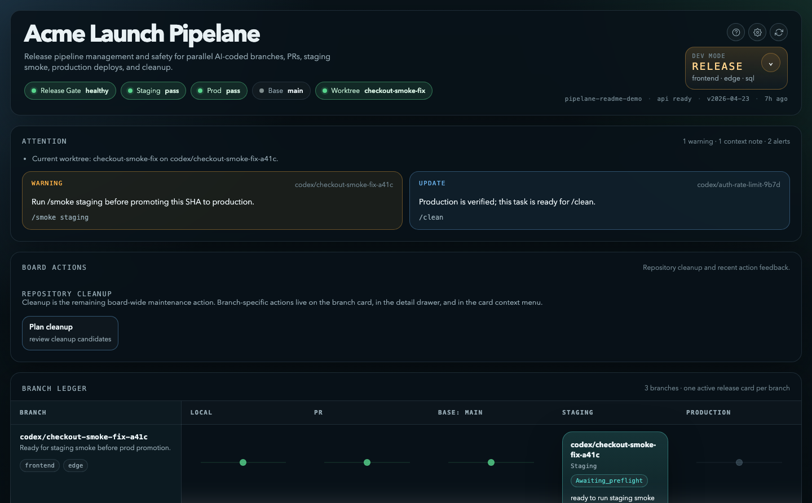

# Pipelane

**Pipelane is a local review, refactor, and release runner for AI-assisted codebases.**

AI agents can now produce code faster than teams can review, merge, deploy, and
recover from it. Pipelane is the operating layer around that work: it creates
safe task workspaces, forces evidence-producing review, moves the approved
change through release, and gives you a cockpit for seeing what is safe to do
next.

Pipelane is local-first. Your repo, GitHub, CI, and deploy provider stay the
source of truth. Pipelane coordinates them so AI-generated work does not become
a pile of branches, half-reviewed diffs, uncertain deploys, and forgotten
cleanup.



## The Big Idea

Vibe coding is not just "ask an AI to write code." That is the first step. The
real leverage comes when the whole development loop becomes structured:

```text
PLAN -> BUILD -> EVAL -> RELEASE -> LOOP
```

Pipelane exists because AI output is probabilistic. A better prompt helps, but
it does not make the result deterministic. The durable answer is a system:

- define the task before building
- run work in isolated task workspaces
- evaluate their output with evidence, not vibes
- put independent review evidence in front of a human before PR handoff
- promote only verified changes through release
- make status, blockers, and rollback visible

The goal is **auditable autonomy**: let agents do more of the inner loop, while
Pipelane records what happened and keeps release safety intact.

## What Pipelane Does

Pipelane gives an AI-assisted codebase four things:

1. **Task workspaces**: create or adopt isolated branches for AI-assisted work.
2. **Review gates**: convert "looks good" into evidence you see before you ship.
3. **Safe release**: move verified changes through build or release mode.
4. **Operator visibility**: show branches, PRs, deploys, blockers, and cleanup
   in one local web view.

Pipelane is not an AI model, a hosted project-management app, or a replacement
for your existing CI and deploy systems. It is the release-management layer that
makes AI coding operational.

## Core Workflows

### 1. `/new`, `/adopt`, and `/resume`

Pipelane starts by putting work in a tracked task workspace. Create a new task
workspace when Pipelane should own the branch, adopt one when another tool or
human already created it, and resume when you need to return to existing work.

```text
/new --task "Add billing export"
/adopt --task "Existing migration work"
/resume
```

### 2. `/deploy` and Safe Release

AI coding increases throughput, so release discipline matters more, not less.
Pipelane separates day-to-day build flow from protected release flow.

Build mode is for repos where production already deploys safely after merge:

```text
/new --task "Ship dashboard filters"
/pipelane review
/pr
/merge
```

Release mode is for changes that must prove the exact merged SHA in staging
before production moves:

```text
/new --task "Ship dashboard filters"
/pipelane review
/pr
/merge
# continue from the shared checkout printed by merge
/deploy staging --pr <merged-pr-number>
/release status
/deploy prod --pr <merged-pr-number>
```

Safe release means:

- review evidence is shown before PR handoff, and shipping without it records
  an explicit `--override --reason` consent
- immutable delivery history records the merged SHA, task mode, and surfaces
- a clean task worktree normally closes after merge; `--keep-worktree` retains it
- staging verifies the same SHA that production will receive, unless a recorded
  `--override --reason` consent promotes without it
- deploys are tied to the expected surfaces
- health checks and verification commands produce evidence
- production promotion is explicit
- rollback remains a first-class path

Use release mode for auth, billing, migrations, data access, customer-visible
launches, multi-surface changes, and anything where "probably deployed" is not
good enough.

### 3. `/pipelane review`

`/pipelane review` is Pipelane's answer to the biggest risk in AI coding:
untrusted output moving too far because it looked plausible.

The philosophy is decorrelated review:

- deterministic checks first: lint, typecheck, tests, build, secret checks
- behavioral evidence next: does the app or workflow actually behave correctly
- independent AI review after that: not the same context that wrote the code
- cross-model or specialist review when the risk is high
- human approval for irreversible decisions

This is the key difference between an eyeball pass and a real eval: a real eval
emits evidence that another tool can enforce later.

Inspect the review model, then persist any intentional changes:

```text
/pipelane review setup
/pipelane review setup C3
```

Then run it before PR handoff:

```text
/pipelane review
```

`/pr` shows the review state for the branch — what ran, what's open, what's
stale — and proceeds. Missing, failed, or pending evidence asks for one
recorded `--override --reason` consent. If review fails, fix the root cause
and run review again.

### 4. `/pipelane web`

`/pipelane web` opens the local Pipelane Board.

The board is the visual cockpit for review and release management. It
shows the state Pipelane already knows:

- what needs attention
- which mode the repo is in
- active branches and worktrees
- PR state
- review and release readiness
- staging and production deploy state
- cleanup readiness
- safe next actions

```text
/pipelane web
```

The board is not a second source of truth. It reads the repo's Pipelane API and
shows what the repo reports.

## Why This Matters

Without a system, AI coding fails in predictable ways:

- success feels random because "correct" was never defined
- review happens only when someone remembers to do it
- branches accumulate faster than they can be reconciled
- deploys happen without confidence about what SHA reached which environment
- rollback is improvised under pressure
- context disappears when the agent session ends

Pipelane turns those failure modes into explicit workflow state. It does not
make the AI deterministic. It wraps the AI in a process that can be checked,
replayed, blocked, resumed, and released.

## Quick Start

Install the local command surface:

```bash
npx -y pipelane@github:jokim1/pipelane#main install-codex
npx -y pipelane@github:jokim1/pipelane#main install-claude
```

Command-surface changes (for example the `/fix` prompt contract) ship with the
package, which installs from `main`: consumers receive them once the change
lands on `main` and they run `pipelane update` (it reinstalls from `main` and
re-renders the installed Claude/Codex skills), or by rerunning the install
commands above. Until then, installed copies keep serving the previous
contract.

To confirm which Pipelane build is actually running, use `pipelane --version`.
Every `pipelane run` command also prints the same identity line (version, short
build SHA with a `-dirty` marker for unclean builds, and install path) as its
first stderr line — structured `--json` output on stdout stays untouched — and
warns on startup when the running build differs from the `pipelane` SHA the
repo pins, or when a built install is older than its own `src/`.

Set up a repo:

```text
/pipelane setup
/pipelane review setup
/pipelane review setup --reset
/pipelane web
```

Setup is machine-local: runtime config, durable runtime copies, update caches,
and workflow state live under `$PIPELANE_HOME` (default `~/.pipelane`). Pipelane
does not create tracked `.claude/commands`, `.agents/skills`, package scripts,
package lockfiles, or Pipelane docs in the application repo.

Pipelane does not generally require Cloudflare credentials, private corpora, or
new repository secrets. A repository can opt in by committing
`.github/pipelane-provisioning.json` when its own CI or deploy workflow needs a
private credential or file. Repositories without that manifest keep the same
setup behavior as before.

For an opted-in repository, plain `/pipelane setup` explains what each declared
input enables, checks its status, and prints the exact next steps. Run
the exact manifest-bound provisioning command printed by setup to install ready
values through GitHub CLI stdin without printing them or committing them to Git.
Repository-relative private files must be Git-ignored. Existing secrets are
preserved; rotation must be explicit.

See [Repository secrets and private CI inputs](docs/public/SECRET_PROVISIONING.md)
for the short step-by-step guide, including Cloudflare tokens, held-out corpus
files, status meanings, verification, and troubleshooting.

Core commands:

| Command | Use it when |
| --- | --- |
| `/new` | Start fresh work in a new Pipelane-managed branch and worktree. |
| `/adopt` | Another model, tool, or human already created the task branch/worktree and Pipelane should track it instead of creating another one. |
| `/resume` | Return to an existing Pipelane-tracked task workspace. |
| `/release enable` | Initialize the optional machine-local release module for repos where staging must prove the exact merged SHA before production moves. |
| `/release status` | Inspect release readiness without failing nonzero. Use this after setup and after staging deploys. |
| `/release doctor --probe` | Refresh live healthcheck evidence used by release readiness. |
| `pipelane run release-check` | Automation/CI gate for blocked release readiness; exits nonzero when release is not safe. |

For release-mode deploys, configure deploy targets and health checks:

```text
/release enable
pipelane configure
/release status
```

Then move work through the normal handoff. In build mode, stop after `/merge`
when production deploys from the base branch automatically; in release mode,
continue through staging and production:

```text
/new --task "Ship dashboard filters"
/pipelane review
/pr
/merge
# continue from the shared checkout printed by merge
/deploy staging --pr <merged-pr-number>
/release status
/deploy prod --pr <merged-pr-number>
/pipelane web
```

Bare `/clean` is a non-destructive preview. Use `/clean --apply --delivered`
to retry delivered cleanup backlogs, or `/clean --apply --task <slug>` to
clear intentional `--keep-worktree` retention and retry that exact task.

## Requirements

- Node.js `>=22.0.0`
- npm
- git
- a repo with a real base branch
- GitHub CLI authenticated for the full PR workflow
- CI and deploy commands for the release workflow

Optional but recommended:

- Codex or Claude Code for agent execution
- gstack for deeper plan, review, QA, and release review workflows

## For Contributors

Install dependencies:

```bash
npm install
```

Run the main checks:

```bash
npm test
npm run typecheck
npm run build
```

Run the local board while developing:

```bash
npm run board
```

Source layout:

- `src/operator`: workflow commands and release logic
- `src/dashboard`: local Pipelane Board
- `docs/public`: deeper workflow references
- `templates`: generated repo guidance and command surfaces

## More Detail

- [Release workflow reference](docs/public/RELEASE_WORKFLOW.md)
- [Pipelane Board reference](docs/public/PIPELANE_BOARD.md)
- [Pipelane API reference](docs/public/PIPELANE_API.md)
